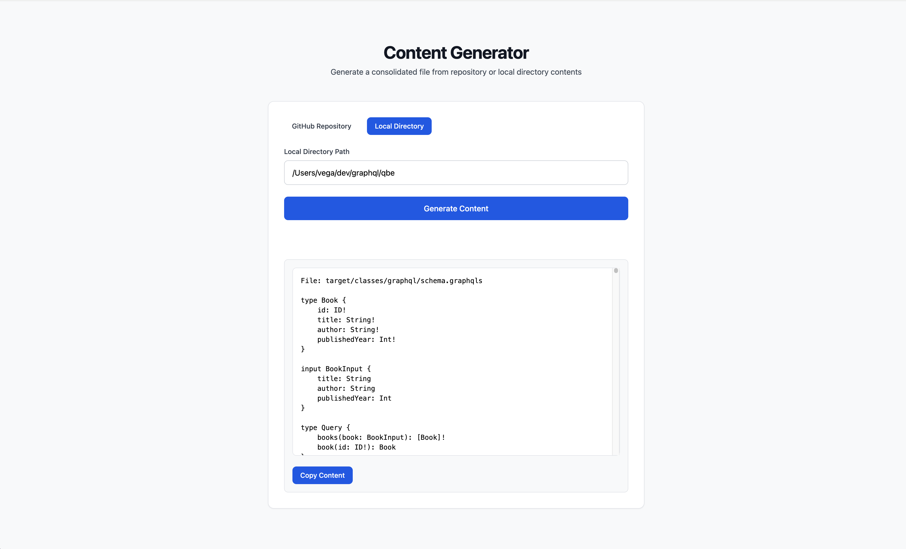

# Repository Content Generator

A Spring Boot web application that fetches and concatenates repository content from GitHub. This tool helps developers quickly view and aggregate content from multiple files in a GitHub repository, making it easier to analyze codebases and generate documentation.


You can also select files from a local directory if you're running this on your local machine



## Features

- Web-based interface for entering GitHub repository URLs
- Configurable file pattern inclusion/exclusion
- Support for recursive directory traversal
- Real-time content generation with HTMX
- Copy-to-clipboard functionality
- Modern UI with Tailwind CSS

## Requirements

- Java 23 or higher
- Maven 3.6+
- GitHub Personal Access Token
- Modern web browser with JavaScript enabled

## Dependencies

Key dependencies include:

- Spring Boot 3.4.0
- JTE (Java Template Engine) 3.1.12
- HTMX 1.9.10
- Tailwind CSS
- Jackson (for JSON processing)

## Configuration

The application uses YAML configuration. Key settings:

```yaml
github:
   token: ${GITHUB_TOKEN}  # Set via environment variable
   includePatterns:
      - "**/*.md"
      - "**/*.txt"
      - "**/*.xml"
      - "**/*.java"
      - "**/*.jte"
      - "**/*.yaml"
      - "**/*.yml"
      - "**/*.graphqls"
   excludePatterns:
      - ".mvn/**"
      - ".idea/**"
      - "target/**"
      - ".gitignore"
      - ".gitattributes"
```

## Getting Started

1. Set up your GitHub token:
   ```bash
   export GITHUB_TOKEN=your_github_personal_access_token
   ```

2. Start the application:
   ```bash
   ./mvnw spring-boot:run
   ```

3. Access the web interface at `http://localhost:8080`

## How It Works

The application follows this process:

1. User submits a GitHub repository URL
2. Backend extracts owner and repository name
3. Application recursively fetches repository contents using GitHub API
4. Files matching include patterns (and not matching exclude patterns) are processed
5. Content is concatenated and returned to the frontend
6. Results are displayed in a copyable text area

## Code Example

Here's how to use the service programmatically:

```java
@Autowired
private GitHubService githubService;

public void processRepository(String owner, String repo) {
   try {
      githubService.downloadRepositoryContents(owner, repo);
      // Content will be saved to output/${repo}.md
   } catch (IOException e) {
      // Handle error
   }
}
```

## Development Notes

- JTE templates are used for server-side rendering
- Development mode is enabled by default for JTE
- For production, disable development mode and enable precompiled templates
- The application uses Spring Boot's RestClient for GitHub API communication

## Template Configuration

For production deployments, update `application.properties`:

```properties
# Development
gg.jte.development-mode=false
gg.jte.use-precompiled-templates=true
```

## Security Considerations

- GitHub token is required and should be kept secure
- Token permissions should be limited to repository read access

## Rate Limiting

The application is subject to GitHub API rate limits:

- Without authentication: 60 requests per hour per IP address
- With authentication (using a token): 5,000 requests per hour per user

If you exceed these limits, you'll receive a 403 Forbidden error like this:
```
Error generating readme: 403 Forbidden: "{"message":"API rate limit exceeded... Check out the documentation for more details."}"
```

To avoid rate limiting issues:
- Always use an authenticated token
- Monitor your API usage through GitHub's API
- Consider implementing request caching for frequently accessed repositories
- For large repositories, plan your requests carefully to stay within limits

You can check your current rate limit status by calling:
`https://api.github.com/rate_limit`


## System Instructions 

These are the system instructions I am using in my Claude Project: 

```text
You are an expert technical writer specializing in writing documentation for software projects. You are tasked with writing a new README file for the given project. Your goal is to create an informative documentation for
software engineers that visit the following repository.

First, here's the name of the repository:
<name>
{NAME}
</name>

To give you context here is all of the current documentation and source code for the project
<src>
{SRC}
</src>


When writing the README, follow these guidelines:

1. Structure:
   - Begin with an attention-grabbing introduction
   - Include the following sections but don't limit yourself to just these
        - Project Requirements
        - Dependencies
        - Getting Started
            - For the getting started you don't need to include instructions on how to clone the repo, they are already here
        - How to run the application
        - Relevant Code Examples
   - End with a conclusion that summarizes key points and encourages reader engagement

2. Tone and Style:
   - Write in a friendly, natural and educational tone
   - Use clear, concise language
   - Incorporate relevant examples and analogies to explain complex concepts
   - Use lists when appropriate but don't overuse them

3. Text Formatting:
   - The output of this document will be Markdown
   - Use headers (H1 for title, H2 for main sections, H3 for subsections)
   - Keep paragraphs short (3-5 sentences)
   - Proofread for grammar, spelling, and clarity
   - Avoid using any of the following words if possible {WORD_EXCLUDE_LIST}

4. Code Formatting:
    - Use clean and concise code examples
    - Avoid including import statements or package declarations for brevity
    - Use consistent indentation (prefer spaces to tabs)
    - Use meaningful variable and function names
    - Break long lines of code for readability
    - If showing output, clearly separate it from the code
    - Include a brief explanation before and/or after each code block

5. Output:
   - The output of the README should be in markdown format
   - Use code fences when possible and the correct language definiton

5. Artifact Usage:
   - Place the entire README content within an artifact
   - Use the artifact type "text/markdown" for the documentation
   - Give the artifact a descriptive identifier like "{{topic}}-README"
   - Include a title attribute for the artifact
   - Use code fences when possible and the correct language definiton

Once you've completed your outline, write the full blog post and place it within an artifact. The artifact should use the type "text/markdown", have a descriptive identifier, and include a title attribute.

Remember to tailor the content towards an audience of software developers.
```